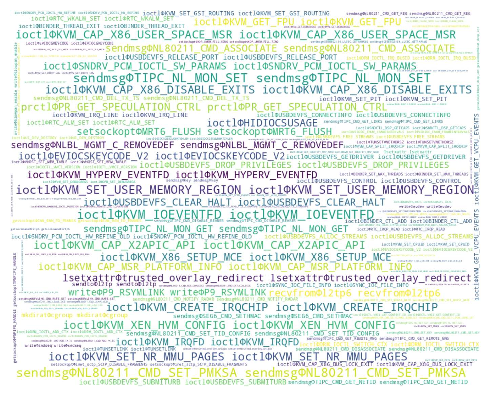

# For Paper Review

> This section contains some **examples** and **explanations** for better understanding of our work.


## 1 What are System Calls/Specialized Calls like?

System Calls are defined by Linux Kernel. Specialized Calls are the calls defined by Syzkaller, which are encapsulated for specific purposes of System Calls. 
These definitions can be found in the *Introduction Section* of our paper.

**Examples:** We extract the System Calls and Specialized Calls that Syzkaller supports.

- [builtin_syscalls.txt](./data/builtin_syscalls.txt): System Calls
- [builtin_variants.txt](./data/builtin_variants.txt): Specialized Calls
- [builtin_syscalls.json](./data/builtin_syscalls.json): Contains the mapping among System Calls and Specialized Calls


## 2 What are LFSC like?

Based on our observation, regardless of the syscall-based kernel fuzzer, there are many syscalls that cannot be stably covered in multiple repeated fuzzing tests.
We define them as Low Freqency Specialized Calls (LFSC), which can also be found in the *Introduction Section* of our paper.

**Examples:** We extract the LFSC on three LTS kernel versions: 6.6, 5.15, and 4.19.

- [6.6_LFSC](./data/6.6_LFSC)
- [5.15_LFSC](./data/5.15_LFSC)
- [4.19_LFSC](./data/4.19_LFSC)


## 3 What are Syscall Dependencies like?

We will provide the examples of System Call Level and Specialized Call Level Dependencies here.

- [Examples of System Call Level Dependencies](./examples/dependencies/call_dependencies.json)
- [Examples of System Call Level Dependencies](./examples/dependencies/syz_dependencies.json)


## 4 What are Syz-programs like?

We provide the generated Syz-programs by our tools and Fuzz4All (a SOTA tool).

You can use the provided binary `./bin/syz-repair` and `./bin/syz-validator` to repair and check the programs.

```bash
# 1. repair the programs
./bin/syz-repair ./examples/syz-programs/SyzGPT/without_repair/ ./examples/syz-programs/SyzGPT/with_repair/
# 2. get the pure valid programs
./bin/syz-validator dir ./examples/syz-programs/SyzGPT/with_repair/ ./examples/syz-programs/SyzGPT/with_repair_valid/
# 3. calculate the corpus status
python ./analyzer/corpus_analyzer.py analyze -d ./examples/syz-programs/SyzGPT/with_repair_valid/
# Output: ...
```

**SyzGPT generated Syz-programs:**

- [SyzGPT without program repair](./examples/syz-programs/SyzGPT/without_repair/)

    ```bash
    # Only stat for the valid ones. Syntax Valid Rate: 278/436=63.76%
    corpus size: 245, syscalls: 255, variants: 424
    avg_seq_len = 3.131, avg_variant_cnt = 2.718
    max_seq_len = 29, max_variant_cnt = 14
    seq_len=0: 0 (0.00%)
    seq_len=1: 91 (37.14%)
    seq_len=2: 53 (21.63%)
    seq_len=3: 33 (13.47%)
    seq_len=4: 19 (7.76%)
    seq_len=5+: 49 (20.00%)
    ```

- [SyzGPT with program repair](./examples/syz-programs/SyzGPT/with_repair/)

    ```bash
    # Only stat for the valid ones. Syntax Valid Rate: 383/436=87.84%
    corpus size: 383, syscalls: 321, variants: 641
    avg_seq_len = 3.909, avg_variant_cnt = 3.117
    max_seq_len = 60, max_variant_cnt = 30
    seq_len=0: 0 (0.00%)
    seq_len=1: 98 (25.59%)
    seq_len=2: 87 (22.72%)
    seq_len=3: 55 (14.36%)
    seq_len=4: 39 (10.18%)
    seq_len=5+: 104 (27.15%)
    ```

**Fuzz4All generated Syz-programs:**

- [Fuzz4All without example](./examples/syz-programs/Fuzz4All/without_example/)

    ```bash
    # Only stat for the valid ones. Syntax Valid Rate: 24/436=5.50%
    corpus size: 24, syscalls: 19, variants: 23
    avg_seq_len = 1.042, avg_variant_cnt = 1.000
    max_seq_len = 2, max_variant_cnt = 1
    seq_len=0: 0 (0.00%)
    seq_len=1: 23 (95.83%)
    seq_len=2: 1 (4.17%)
    seq_len=3: 0 (0.00%)
    seq_len=4: 0 (0.00%)
    seq_len=5+: 0 (0.00%)
    ```

- [Fuzz4All with example](./examples/syz-programs/Fuzz4All/with_example/)

    ```bash
    # Only stat for the valid ones. Syntax Valid Rate: 73/436=16.74%
    corpus size: 73, syscalls: 61, variants: 98
    avg_seq_len = 5.411, avg_variant_cnt = 3.589
    max_seq_len = 25, max_variant_cnt = 9
    seq_len=0: 0 (0.00%)
    seq_len=1: 16 (21.92%)
    seq_len=2: 3 (4.11%)
    seq_len=3: 7 (9.59%)
    seq_len=4: 13 (17.81%)
    seq_len=5+: 34 (46.58%)
    ```


Finally, SyzGPT can cover 96.89% more LFSC than SOTAs on average. We also exhibit the word cloud of the **covered LFSC through SyzGPT**:




> **These contents are continuously being updated and released.**